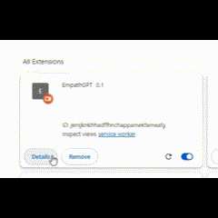

# EmpathGPT

## Overview
EmpathGPT is a browser extension designed for emotion recognition in text-based interactions, enhancing user experiences on chat platforms.

## Features
- Utilizes the javascript face-api.js api to analyze a users face infer emotional context while they prompt chatgpt on the openai website.
- The EmpathGPT extension then uses your percieved emotion to inject more text into your chatgpt prompt so that chatgpt responds accordingly and empathetically.

## Installation
1. Download the extension package.
2. Load it in your browser as an unpacked extension.

3. Enable camera permissions for the chrome extension

## Usage
- Click the extension icon to view the popup.
- Navigate to `https://chat.openai.com/*` to enable automatic emotion analysis in chats.

## Background Service Worker
- Located at `/src/js/worker.js`.

## Content Script
- Auto-injects `/src/js/content.js` when the user is on `https://chat.openai.com/*`.

## Resources
- `face-api.min.js`: For facial emotion recognition.

## Version
- Current version: 0.1

## Development and Contribution
Contributions to EmpathGPT are welcome
